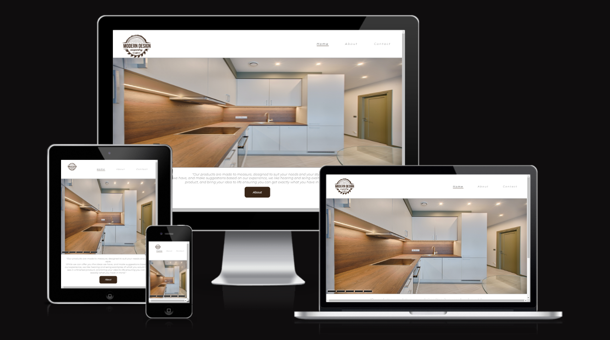
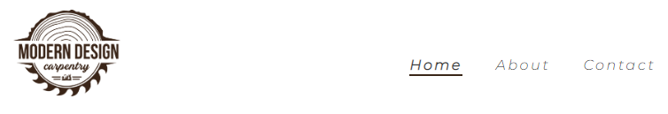
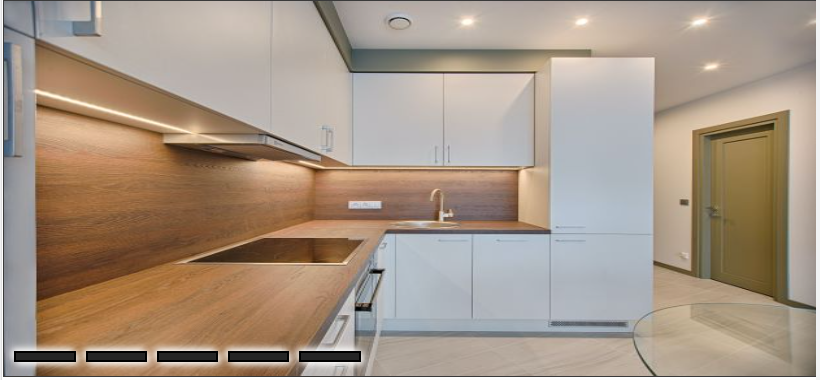
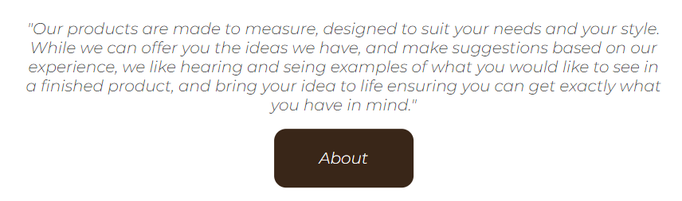
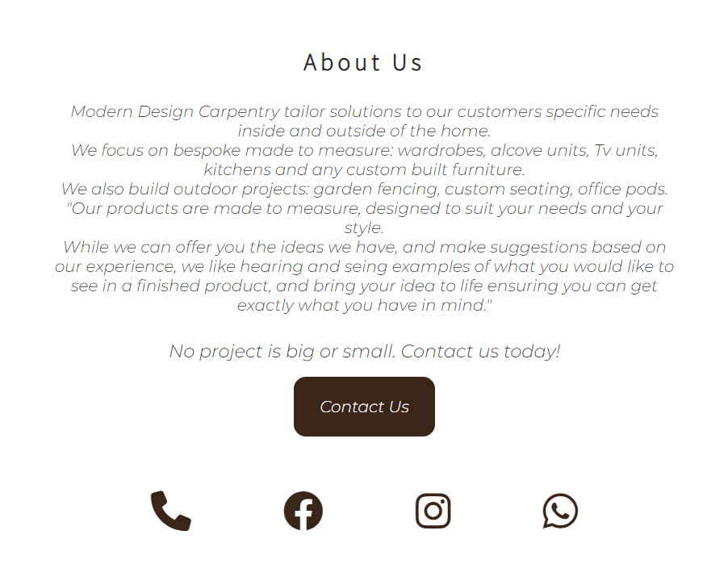
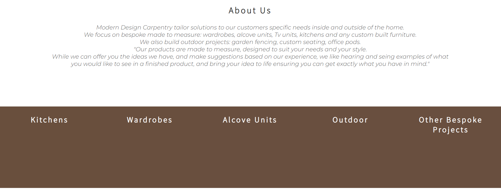
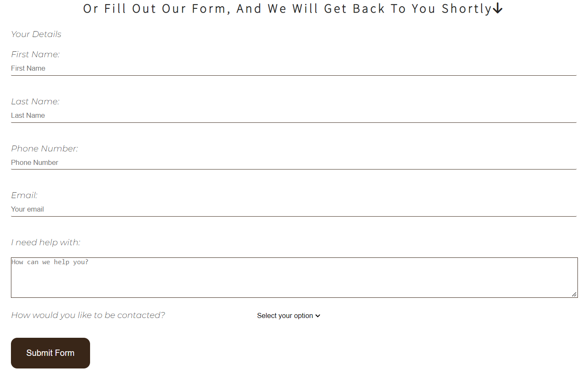

# Modern Design Carpentry

Welcome to [Modern Design Carpentry Website](https://ivanildeslacey.github.io/1stModernDesignCarpentry/index.html)!

Modern Design Carpentry is a real company that so far has gained all work only from recommendations and Instagram page.

The purpose of this website is to help the business with targered keywords around what the business does to gain more visibility.

### Existing Features

__Navigation Bar__

- Featured on all three pages, the full responsive navigation bar includes links to the Logo, Home page, About and Contact page and is identical in each page to allow for easy navigation.
  - This section will allow the user to easily navigate from page to page across all devices without having to revert back to the previous page via the ‘back’ button.

__The landing page image__

  - The landing page includes a slide with five photos, this is not the most sofisticated slide but it is made exclusively with HTML and CSS using input radio button. 
  - This section introduces the user to some of the work that the business does.

__Mission Statment__

  - The mission statment section will allow the user to know bit more about the business from the main page, with a link button that sends the user to the "About" page.
  - This user will be able to go with the flow of the website without having to use the main nav menu.

__About page__

  - This page will allow the user to read some examples of products the business works with and also has a button link that flows with the website for the contact page. 
  - This page has two different configurations one for large to medium screen sizes and one for small screen sizes.
  - Small screen sizes will display only mission statment, example of some of the work that the business does and button for contact page.

  

  - Bigger screen sizes will have a container with some examples of the work done by the business and a caption with a button link for contact us page that will be shown when hovered over.

  

__Contact page__

- Contact page display of same footer options at the top of the page to atract people that visit the website to follow the business on other social media.
- And for people that prefer, it also contains a simple form that asks for simple information and a dropdown option to how the customer would like to be contacted back. This form sends the information filled by the costumer to the business email.

__The Footer__ 

  - The footer section includes links to the relevant social media sites for Modern Design Carpentry as well as a link to direct call and whatsapp message. The links will open to a new tab to allow easy navigation for the user and they change color when hovered to the apps original color.

  

  ### Features Left to Implement

- Implement Gallery page.
- Implement hamburger menu for smaller screens.
- Implement different style for main slide when learning JavaScript.

## Testing

- The website was first tested using HTML W3C validator and CSS Jigsaw validator. For CSS no errors were found and for html main errors were found on contact us page as the social media links repeat twice so I had same ids twice.

- Testing the website for different screen sizes was the most difficult part. The main page was becoming distorted as the main slide was done by following a video, when reading and understanding each element on the css for the slide I noted that the position of the slide was absolute and had to find a different way to have the same effect for the slide so it wouldnt compromise the rest of the page when changing sizes.
- This website was also tested in chrome, microsoft edge, also different screen devices.
- Performance testing was done and the photos were downsized to improve performance.
- All links were tested: call, whatsapp message, social medias, form, and button links.

### Validator Testing 

- HTML
  - No errors were returned when passing through the official [W3C validator](https://validator.w3.org/nu/?doc=https%3A%2F%2Fivanildeslacey.github.io%2F1stModernDesignCarpentry%2Findex.html)
- CSS
  - No errors were found when passing through the official [(Jigsaw) validator](https://jigsaw.w3.org/css-validator/validator?uri=https%3A%2F%2Fivanildeslacey.github.io%2F1stModernDesignCarpentry%2Findex.html&profile=css3svg&usermedium=all&warning=1&vextwarning=&lang=en)

  ## Deployment

This section should describe the process you went through to deploy the project to a hosting platform (e.g. GitHub) 

- The site was deployed to GitHub pages. The steps to deploy are as follows: 
  - In the GitHub repository, navigate to the Settings tab 
  - From the source section drop-down menu, select the Master Branch
  - Once the master branch has been selected, the page will be automatically refreshed with a detailed ribbon display to indicate the successful deployment. 

  ## Credits 

- Instructions on how to make the HTML CSS slider was taken from [YouTube Tutorial](https://www.youtube.com/watch?v=i1HlXOK-_0Y)
- Instructions on how to make the HTML CSS content box for about page was taken from [YouTube Tutorial](https://www.youtube.com/watch?v=m91pL94YLvg/)
- The README.md was created from tehe template on [Read me Code Institute template](https://codeinstitu-readmetempl-qoifx2tgg35.ws-eu64.gitpod.io/).

### Content 

- The icons in the footer were taken from [Font Awesome](https://fontawesome.com/)

### Media

- The images used for this website project were taken from [Pexels](https://www.pexels.com/) as the photos that the business have became pixalated on the website.
